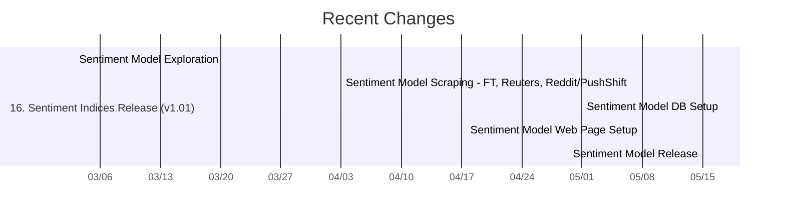

# ABOUT
This project contains the code for data scraping, data cleaning, and modeling used to generate forecasts shown on [econforecasting.com](https://econforecasting.com).

# RUN
This code is developed locally on a Windows machine and deployed locally to an Ubuntu VPS. The modeling code is primarily run in R (>=4.1.2) but some scraping scripts make calls to Python (=3.8.7). Modules are imported wholesale using the `reticulate` package. Data and model features are stored in a Postgres/TimescaleDB server hosted on the VPS.

---
# CHANGELOG

## [v1.03] 
- TBD: Add Conference Board, TD Forecasts
- TBD: Consider replacing 14d default w/28d default

## [v1.02] (Sentiment Index Improvements)
- Added initial detailed labor market modeling
- Added labor market subindex integration with main index
- Fixed critical bug with sentiment aggregation TZ casting

## [v1.01] (Model Improvements & Sentiment Index) (2022-05-16)
This adds sentiment index modeling, along with minor modeling improvements and additions. 
- Added ICE scraper with SONIA, ESTR rates (Euribor rates delayed due to historical data issues)
- Added Reuters scraper and Reddit API scraper for sentiment analysis
- Added initial score analysis w/ BERT and dictionary
- Added sentiment index scraping for official media sources
- Added sentiment index scraping for PushShift & Reddit
- Added sentiment index ReReddit scraper for backfilling data
- Added sentiment index DistilBERT, RoBERTa, and dictionary scoring
- Added sentiment index DB storage
- Added sentiment index aggregation and model stacking
- Added sentiment index scoring fixes and pull fixes

## [v.020 -> v1.00] (Model Modularization & Re-Release) (2022-03-02)
This continues modularization & adds an initial web release on beta.econforecasting.com.
- Added SPF, CBO, WSJ external forecasts
- Added reticulate Python integration
- Added Fannie Mae data parsing
- Added nowcast model with correct aggregations and stationary transformations (by vintage date)
- Added nowcast model DB storage
- Added UUP import to replace FRED USD source (vintage dates start too late)
- Added modules system
- Added split of external forecast inputs
- Added centralized logging system
- Added split of consensus futures model from extenral forecasts
- Added fully improved SQL table structure
- Added better optionalization of SQL tables
- Added optimized stationary transforms
- Added CPI EINF calcs
- Added intial composite model for PCE & GDP
- Cleaned up old files
- Deprecated Quandl data input
- Fixed bug in get_fred_data related to observation date pulls
- Fixed STLFSI with updated version
- Fixed SQL table key issues
- Improved nowcast docs

## [v0.19] (Model Backtesting and Vintage Analysis)
This is a full model rewrite. The rewrite for the full-scale model is delayed, but immediate releases of external forecasts & composite external forecasts are intended for the version. In addition, alternate indices are included in the release. The code is restructured to build a more comprehensive backend built off TimescaleDB/Postgres with proper vintage storage, but with more intermediary and partial releases. 
- Added calculated variables to historical data load
- Added calculations for getting last date by vintage date
- Added AMERIBOR & Bloomberg BSBY rate imports
- Added modularization of interest rate models
- Added cleanup of Treasury rate forecasts
- Added AMERIBOR & BSBY forecasts
- Cleaned up TDNS model code
- Removed Cleveland Fed FRED pull (inconsistent data)
- Removed old junk in README

## [v0.18] (Model Rewrite Prep)
- Added new TimescaleDB compatible data pulls
- Removed all old/junk files

## [v0.17] (Model Productionalization)
- Added task scheduling abilities for updated models
- Added splitting of SQL inserts due to memory issues
- Added code for sentiments analysis to SQL
- Added advanced sales subcomponents, and disprank/disptabs for website display
- Added new helper functions and prepared package for CRAN addition
- Added new repository for vintage data
- Added code to move package to prod site
- Added code to move pull-external-forecasts invariant to dev server (set EF_DIR in .renviron)
- Fixed issue with inflation forecast spacing
- Fixed issue with using SQL queries not returning modified rows
- Fixed issue with WSJ scraping not working on prod site (needed headers)

## [v0.16] (CSM Forecasting & Initial Model Rewrite) (2021-09-03)
- Added CSM forecasting code
- Added model stacking for PCA->DFM->Kalman Filter process to reduce variance due to factor selection
- Added qualitative forecasts for mortgage rates and mortgage spreads
- Added bank deposits, C&I, bank credit and converted bank RE to weekly index for DFM inputs
- Added JOLTS to DFM inputs (changed stationary form to base values)
- Added better qualitative forecasting output checks & graphs
- Added automatic export of qualitative forecasting graphs for model checking
- Added rewrite of CSM exogenous df to reflect refactoring in qualitative forecasts
- Added split of mandatory exogenous variables (used in calc of forecast dates) from variables which can be exog for some dates, endog for others
- Added nice charts and evaluation for structural forecasts 
- Added better implementation of structural forecasts
- Added allowance for multiple structural model scenarios
- Added improved error handling in model estimation procedure
- Added weighted moving averages to structural equations
- Added refactored SQL code
- Added propert constraints to SQL tables
- Improved structuring of columns on inputs.xlsx for better notation of structural input types and output types
- Removed CFNAI and WEI from DFM inputs

## [v0.15] (2021-07-26)
- Added rewrite of model flow: (1) data, (2) nowcasts, (3) qual forecasts, (4) csm
- Added table of releases to inputs
- Added refactoring of release date pulling process
- Added nowcast d2 transformation
- Added date pull to reflect VINTAGE_DATE
- Added Empire State Mfg Index - Capital Expenditures to replace Manufacturing Conditions due to high variance of induced PCA estates
- Added more financial indices: ag commodities ETF, metals ETF, ex-US equities ETF
- Added qualitative forecasts
- Added detransformation for qualitative forecasts
- Added CSM exogenous table
- Improved nowcast variables to match structure of other variable data (obj$[[form]]$[[freq]])
- Removed some old unused files

## [v0.14] (2021-06-24)
- Added better data import system
- Added better data transform system
- Added cleaner EOM aggregation system
- Added automatic cookie scraping from CME site to bypass block
- Added separation of external forecasts from initial forecasts
- Added initial forecasts framework in DB
- Added nowcast SFTP upload
- Added some updates to sentiments model
- Added more imports to WSJ
- Fixed WSJ forecasts since now quarterly (since April 2021)
- Fixed bug with CME scrape (removed cookie set)
- Removed JOLTS new hires from inputs (missing data in 2010)

## [v0.13] (2021-05-25)
- Added importing of releases & release dates for input data series into nowcast models
- Added SQL export of releases & release dates
- Added new shipments, new business applications
- Added releases table to SQL
- Added notes re: purl toggle
- Added code to cleanup old .tex and .pdf files, as well as clean images directory
- Added error logging to task scheduler
- Improved 3-month -> 12-month moving-average inhistorical inflation data
- Fixed bug caused by optimizing DNS yield curve parametrization over MAPE instead of MAE (MAPE was returning Inf values)
- Removed WEI index

## [v0.12] (2021-05-07)
- Added structural basics with impulse response
- Added headers to CME scraping; user-agent now required to access JSON files
- Added task scheduler for Windows automation of scripts
- Added updated project management spreadsheet
- Fixed bug in documentation (xtables)

## [v0.11] (2021-03-19)
- Added backtest code for nowcasts
- Added code for iterating over vintage dates
- Added JOLTS data to model inputs
- Added formatted table for diagnostic factor weights
- Added elastic net regularization to quarterly dynamic factor models
- Added elastic net hyperparameter selection plots
- Added some of the new regularization info to documentation
- Added alpha boundaries to (.5, 1) due to overregularization of some consumption variables 
- Fixed bug related to knitr::purl
- Fixed bug related to SQL insert

## [v0.10] (2021-03-06)
- Added import spreadsheet
- Added GDP subcomponents
- Added deseasonalization information
- Added first monthly interpolation
- Added Kalman filtration code
- Added PCA analysis
- Added dynamic factor models
- Added documentation for Kalman filter
- Added backtransformation functions
- Added many new PCA variable
- Added FRED GET to RETRY
- Added Bai-Ng information criteria for scree plot DFM
- Added Yahoo Finance import
- Added plots for PCA, Kalman filter & smoother, VAR, DFM
- Added in-sample goodness of fit for VAR & DFM
- Added documentation for VAR, DFM, & intro
- Added documentation templates
- Added SQL insert
- Added ability to pull data from particular vintage date
- Added purl code to extract main rmd code and convert it to a function - use for backtesting
- Fixed bug with monthly aggregation
- Fixed bug with specific vintage date pulls from ALFRED database

## [v0.09] (2021-02-13)
- Added mortgage models
- Added misc stationary transform functions for structural modeling
- Added addLags() function
- Added historical data aggregation for SEMs
- Added expected inflation models
- Added prep for Kalman smoothing & interpolation

## [v0.08] (2021-02-09)
- Added monthly aggregation for daily-data forecasts
- Added SOFR web scraping
- Fixed some issues with inconsistent variable names

## [v0.05] (2021-02-03)
- Added dynamic Nelson-Siegel interest rate decomposition & forecasting model
- Added code to allow for SPF pulling for more variables
- Added code to pull historical data of multiple frequencies
- Added SQL inserts to fc tables
- Added SQL insert function
- Improved overall code organization in forecasts.rmd

## [v0.04] (2021-01-29)
- Added historical data scraping code
- Added code for fed funds rate
- Fixed bug in data upload
- Fixed bug in getDataFred()
- Fixed bug in package description compilation

## [v0.03] (2021-01-13)
- Added code for calculating asset contagion index
- Added code for splitting RESET_ALL runs from update runs
- Added code for truncating tables on RESET_ALL runs

## [v0.02] (2021-01-09)
- Added code for remote SQL connection
- Added code for calculation of cross-asset rolling correlation statistics
- Added code for remote SFTP and COPY batch insert of asset-correlation data

## [v0.01] (2021-01-08)
- Added web scraping code for CBO
- Added web scraping code for FRED
- Added web scraping code for WSJ
- Added web scraping code for Philadelphia Fed 

## [v0.00] (2021-01-07)
- Added initial package setup
- Added initial web scraping frameworks etup
